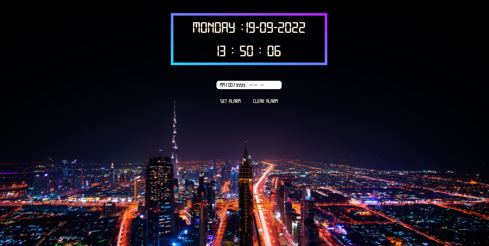
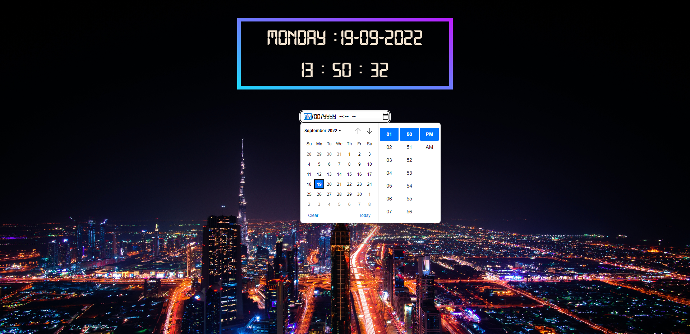
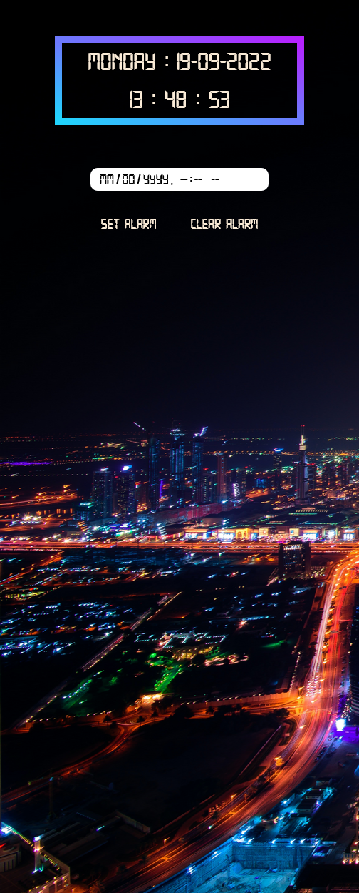

# Pixellab personal project - JavaScript Clock website design

## Overview

This was my second personal project to make for the Pixellab's Frontend Web Development course, that I attended. It represented a clock website for two resolutions (desktop and mobile devices). This project was entirely implemented using Vanilla JavaScript programming language and Netlify to publish it online (https://tiny-pixie-218768.netlify.app).
The website design was realized by me.

### The challenge

Users should be able to:

- View the optimal layout depending on their device's screen size.
- To view the correct local timezone.
- To set and clear the alarm.
- To receive a notification when the alarm "rings".

### Screenshot

HOMEPAGE

### Links

- Solution URL: [Github URL](https://github.com/PaulaDuduta/js-clock)
- Live Site URL: [Netlify homepage](https://tiny-pixie-218768.netlify.app)

### Built with

- JavaScript
- Semantic HTML5 markup
- CSS custom properties
- Flexbox
- Mobile-first workflow

## Author

- GitHub - [@PaulaDuduta](https://github.com/PaulaDuduta)
